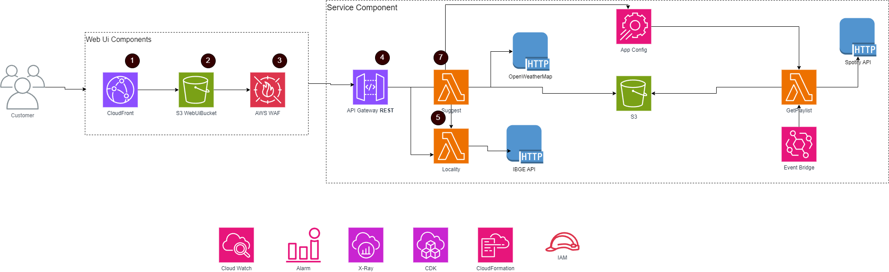

# Documentação da Aplicação: Serviço de Sugestão de Músicas Baseado na Temperatura

### Visão Geral

Este projeto implementa um serviço que sugere playlists de música com base na temperatura atual de uma cidade fornecida. O serviço utiliza a API do OpenWeatherMap para obter a temperatura e a API do Spotify para sugerir músicas de acordo com as regras definidas.

### Acesso

[`https://of657bxuc3.execute-api.us-east-1.amazonaws.com/prod/suggest?city=Belém`](https://of657bxuc3.execute-api.us-east-1.amazonaws.com/prod/suggest?city=Bel%C3%A9m)

### CI/CD

Existe uma configuração básica de CI/CD usando github actions, pode ser visto na pasta  `.github/workflows` , a configuração é ao ser aberto um PR uma esteira de CI vai ser ativada em cima da branch de origem.

Caso um commit novo entre na main uma esteira de CD vai ser ativada publicando o código em produção.

### **Requisitos Gerais**

1. **Conta na AWS**
2. **AWS CLI Configurada**
    - **Descrição**: Ferramenta de linha de comando para interagir com a AWS.
    - **Instalação**: [AWS CLI](https://aws.amazon.com/cli/)
    - **Configuração**: Execute `aws configure` para configurar suas credenciais e região.
3. **Node.js e npm**
    - **Descrição**: Ambiente de execução para JavaScript e gerenciador de pacotes.
    - **Instalação**: [Node.js](https://nodejs.org/)
    - **Verificação**: Execute `node -v` e `npm -v` para verificar a instalação.
4. **AWS CDK (Cloud Development Kit)**
    - **Descrição**: Ferramenta para definir a infraestrutura da AWS como código.
    - **Instalação**: Execute `npm install -g aws-cdk`
    - **Verificação**: Execute `cdk --version` para verificar a instalação.
5. **Docker**
    - **Descrição**: Plataforma para criar, implantar e rodar aplicações em contêineres.
    - **Instalação**: Docker
    - **Verificação**: Execute `docker --version` e `docker-compose --version` para verificar a instalação.
    

### Requisitos Funcionais

1. **Acessibilidade via API**
    - O serviço é exposto através de uma API REST acessível publicamente.
    - Endpoints e métodos HTTP estão documentados na seção "Endpoints da API".
2. **Entrada: Nome da Cidade**
    - O serviço aceita o nome de uma cidade como parâmetro de entrada.
    - A cidade deve ser fornecida como um parâmetro de consulta (`query parameter`).
3. **Regras de Sugestão de Playlist Baseadas na Temperatura**
    - **Temperatura > 25ºC**: Sugere músicas do gênero **Pop**.
    - **Temperatura entre 10ºC e 25ºC**: Sugere músicas do gênero **Rock**.
    - **Temperatura < 10ºC**: Sugere músicas do gênero **Clássico**.

### Tecnologias Utilizadas

- **AWS Lambda**: Função serverless que executa a lógica do serviço.
- **AWS CDK**: Usado para definir e implantar a infraestrutura do serviço.
- **API Gateway**: Fornece a interface HTTP para a função Lambda.
- **OpenWeatherMap API**: Usado para obter a temperatura da cidade fornecida.
- **Spotify API**: Utilizado para obter as playlists baseadas no gênero musical.

### Arquitetura

1. **Entrada**:
    - Um cliente faz uma requisição HTTP GET ao endpoint do serviço, passando o nome da cidade como um parâmetro de consulta.
2. **Processamento**:
    - A função Lambda usa a API do OpenWeatherMap para buscar a temperatura atual da cidade.
    - Com base na temperatura, a Lambda determina o gênero musical adequado (Pop, Rock, Clássico).
    - A Lambda então autentica-se na API do Spotify para obter um token de acesso.
    - A Lambda usa o token para chamar a API de recomendações do Spotify, retornando uma lista de músicas.
3. **Saída**:
    - O serviço retorna um JSON contendo as sugestões de músicas.

### Endpoints da API

- **`GET /suggest`**
    - **Descrição**: Retorna uma playlist de músicas baseada na temperatura atual da cidade fornecida.
    - **Parâmetros**:
        - `city` (string) - Nome da cidade (obrigatório).
    - **Resposta**:
        - **Status 200**:
            
            ```json
            {
              "genre": "Pop",
              "musicSuggestions": ["Song1", "Song2", "Song3"]
            }
            
            ```
            
        - **Status 400**:
            
            ```json
            {
              "error": "City parameter is required"
            }
            
            ```
            
        - **Status 500**:
            
            ```json
            {
              "error": "An error occurred"
            }
            
            ```
            

### Autenticação e Segurança

- **Autenticação no Spotify**:
    - A autenticação é realizada usando as credenciais `client_id` e `client_secret` que são armazenadas no AWS Secrets Manager.
    - A cada requisição, a Lambda obtém um token de acesso temporário que é usado para chamar a API de recomendações do Spotify.

### Testes

- **Testes Unitários**:
    - As funções principais da Lambda, como a obtenção da temperatura, o mapeamento para o gênero musical, e a autenticação no Spotify, são testadas usando Jest.
- **Testes de Infraestrutura**:
    - A definição da infraestrutura é testada usando o módulo `assertions` do AWS CDK para garantir que os recursos foram configurados corretamente.

### Deploy e Configuração

1. **Pré-requisitos**:
    - Node.js e npm instalados.
    - AWS CLI configurado.
2. **Passos para Deploy**:
    - Clonar o repositório.
    - Instalar as dependências: `npm install`.
    - Configurar as variáveis de ambiente no arquivo `.env`.
    - Deploy da infraestrutura: `cdk deploy`.
3. **Configuração do `.env`**:
    - O arquivo `.env` deve conter as seguintes variáveis:
        
        ```bash
        OPENWEATHERMAP_API_KEY=your_openweathermap_api_key
        SPOTIFY_CLIENT_ID=your_spotify_client_id
        SPOTIFY_CLIENT_SECRET=your_spotify_client_secret
        
        ```
        

---

## Desenho inicial da arquitetura

<aside>
📢 Não tive tempo de implementar tudo que eu queria.

</aside>



> Basicamente haveria um front-end em react que faria toda a orquestração desse fluxo, seria bem parecido com o que é hoje com o detalhe de que eu faria um Event Bridge para 1 vez ao dia buscar as musicas de cada gênero e salvar em um s3 para que o lambda puxe diretamente da infra da aws e não dependa da request até o spotify - fica de melhoria hehehe
> 

## Justificativas

### Técnicas

- **Padrão de API (RESTful)**:
    - Escolhido pela simplicidade, flexibilidade e ampla compatibilidade com diversos clientes. REST também permite caching e escalabilidade horizontal, ideal para serviços stateless como este.
- **Linguagem de Programação (TypeScript com Node.js)**:
    - **TypeScript**: Fornece tipagem estática, melhorando a qualidade do código e reduzindo erros em tempo de execução.
    - **Node.js**: Excelente para operações I/O intensivas, além de ser nativamente suportado pelo AWS Lambda, facilitando o desenvolvimento e integração.
- **Frameworks e Ferramentas**:
    - **AWS CDK**: Permite definir infraestrutura como código, facilitando a automação, consistência entre ambientes e integração com sistemas de versionamento.
    - **Jest**: Escolhido por sua facilidade de uso e suporte para TypeScript, ideal para garantir a qualidade do código por meio de testes unitários.
- **Serviços de Terceiros**:
    - **OpenWeatherMap API**: Fornece dados meteorológicos precisos e em tempo real, essenciais para a lógica do serviço.
    - **Spotify API**: Oferece um vasto catálogo de músicas organizadas por gênero, garantindo sugestões musicais atualizadas e relevantes.
    - **AWS Secrets Manager**: Utilizado para armazenar credenciais sensíveis com segurança, permitindo a rotação automática e minimizando riscos de exposição.

### Arquiteturais

- **Arquitetura Serverless (AWS Lambda)**:
    - **Escolha**: Usar AWS Lambda permite que o serviço escale automaticamente conforme a demanda, sem a necessidade de gerenciar servidores. Isso reduz custos e simplifica a manutenção.
    - **Benefícios**: Alta disponibilidade e custo baseado apenas no uso real, ideal para serviços com tráfego variável.
- **API Gateway**:
    - **Escolha**: O AWS API Gateway é usado para expor a Lambda como uma API. Ele gerencia autenticação e tráfego, e é escalável.
    - **Benefícios**: Facilita a integração com a Lambda e protege contra sobrecarga, com suporte para milhares de requisições simultâneas.
- **AWS CDK (Cloud Development Kit)**:
    - **Escolha**: AWS CDK define a infraestrutura como código, o que facilita a automação e a consistência entre ambientes.
    - **Benefícios**: Permite criar e gerenciar a infraestrutura de forma eficiente e confiável, com menos erro humano.
- **AWS Secrets Manager**:
    - **Escolha**: Armazena credenciais sensíveis de forma segura, evitando que apareçam no código.
    - **Benefícios**: Garante que as informações sensíveis sejam protegidas e rotacionadas automaticamente, aumentando a segurança.
- **OpenWeatherMap e Spotify APIs**:
    - **Escolha**: OpenWeatherMap fornece dados de clima, e Spotify oferece músicas. São confiáveis e amplamente usadas.
    - **Benefícios**: Garantem acesso a dados e recursos essenciais para a funcionalidade do serviço, com alta qualidade e suporte contínuo.

### Desempenho, **Resiliência, Escalabilidade**

- **Desempenho**: AWS Lambda e API Gateway garantem respostas rápidas e eficientes com baixo custo, processando requisições de forma ágil.
- **Resiliência**: A arquitetura serverless e o uso de AWS Secrets Manager asseguram alta disponibilidade e recuperação automática em caso de falhas.
- **Escalabilidade**: AWS Lambda escala automaticamente com a demanda, e API Gateway suporta grandes volumes de tráfego, adaptando-se a picos de uso sem problemas.